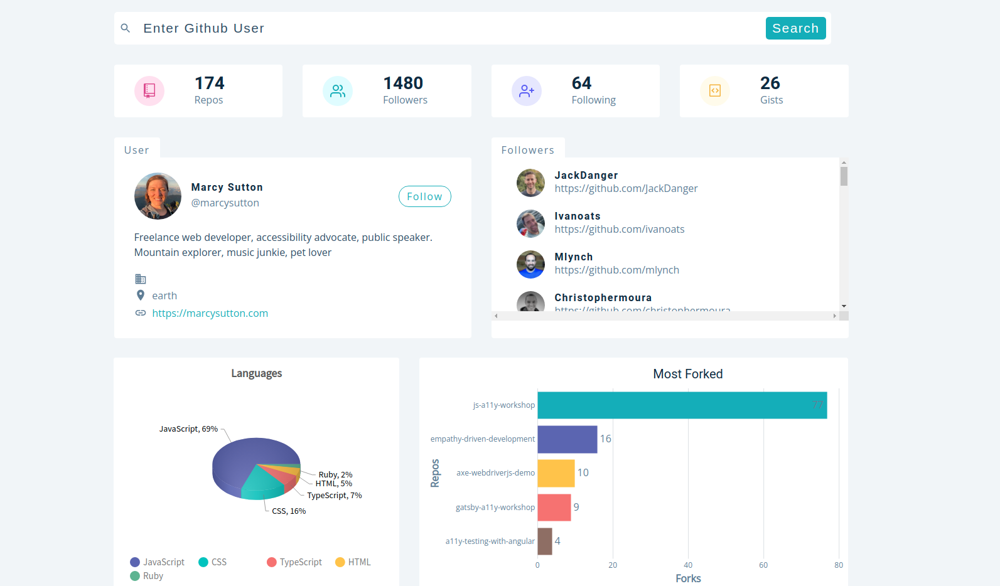

# GitHub Searcher App

## This project is under development.

### About

This is Github Searcher app that allows the user to search for Github profile and see specific information and stats on it.

The app uses GitHub API to interact with the backend.

### Goal

To create Github search engine app that lets you search/find developers and projects.

### Features

- It allows the user to search for specific profile.
- it shows information and stats about the profile.

### Built using

For the last few months I have been working with React and Redux, So this is what I am using to build this app:

- ReactJs: Front-end framework
- Redux: State management
- FusionCharts: Chart library

### Feedback

Like I just mentioned this project is under development, if you find or see some issues please open one issue and if you need/want a feature you can also make a request for said feature :)

### Running locally

1. Open a terminal and clone the repo using the following command: `git clone`
2. Install the dependencies using the following command: `npm i`
3. And run the following command: `npm start`
